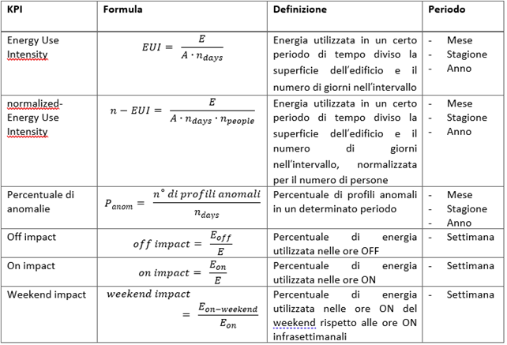
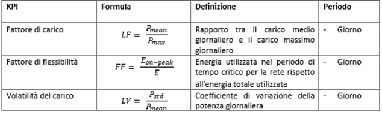
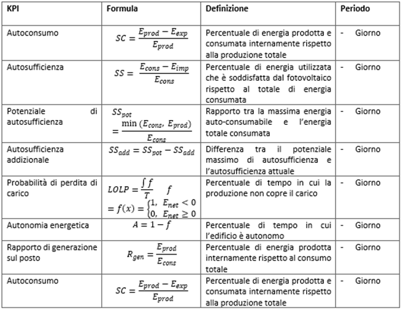

# Valutazione di indicatori compatti di prestazione

Il modulo `kpi` contiene le funzionalità per il calcolo degli indicatori di prestazione energetica. Gli indicatori sono calcolati a partire dai dati di potenza consumata e prodotta dall'edificio.

Sono disponibili tre tipologie di indicatori:
- *Prestazione energetica*
- *Flessibilità energetica*
- *Utilizzo della fonte rinnovabile*

La lista degli indicatori per ogni categoria sono i seguenti:

**Prestazione energetica**



**Flessibilità energetica**



**Utilizzo della fonte rinnovabile**



Il modulo è organizzato nel seguente modo:
- `kpis.py` contiene le funzioni per il calcolo degli indicatori di prestazione energetica.
- `utils.py` contiene le funzioni di supporto per il calcolo degli indicatori.
- `calculate.py` contiene le funzioni per il calcolo di ognuna delle categorie di indicatori, sia su base giornaliera che aggregata (in base alla tipologia di indicatore).
- `viz.py` contiene le funzioni per visualizzare gli indicatori (boxplot, heatmaps e radar plot).
- `config.json` contiene il dizionario di configurazione per ogni indicatore, utile per formattare correttamente i risultati.
- `main.py` contiene la funzione generale per la pipeline di calcolo degli indicatori per un intero aggregato (`run_kpi`). La pipeline calcola tutti gli indicatori, salva i risultati e le visualizzazioni all'interno delle cartelle `results/kpi` e `figures/kpi`.

## Utilizzo

```python
import pandas as pd
import os

from settings import PROJECT_ROOT
from src.energy_analytics import Building, Aggregate, run_kpi


data_DU1 = pd.DataFrame()
metadata_DU1 = {}

data_DU2 = pd.DataFrame()
metadata_DU2 = {}

weather = pd.DataFrame()

DU1 = Building(data=data_DU1, weather_data=weather, metadata=metadata_DU1)
DU2 = Building(data=data_DU2, weather_data=weather, metadata=metadata_DU2)

aggregate = Aggregate(name="anguillara", buildings=[DU1, DU2])

for building in aggregate.buildings:
    building.pre_process()

cluster = pd.read_csv(os.path.join(PROJECT_ROOT, "results", "benchmarking", "cluster_anguillara_assigned.csv"))

run_kpi(aggregate, cluster)
```